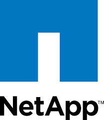

# Kubernetes on premise

La souverainté a un prix

#RennesDevops 03/10/2024

<!--
Intro: racontez les étapes pour avoir monter un cluster OnPremise, s'excuser pour les slides en FR...
-->

---
transition: fade-out
layout: two-cols
---

# Présentation

**Julien TRUNDE**

* Ingénieur InfraAsCode

* Société IRT B<>Com

* Compétences:

<div class="grid grid-cols-3 gap-y-5 justify-items-center">

  <div>
    <logos-ansible class="text-3xl"/>
  </div>
  <div>
    <logos-kubernetes class="text-3xl"/>
  </div>
  <div>
    <logos-terraform class="text-2xl"/>
  </div>
  <div>
    <devicon-plain-vault-wordmark class="text-4xl"/>
  </div>
  <div>
    <devicon-argocd-wordmark class="text-5xl"/>
  </div>
  <div>
    <logos-vmware class="text-1xl"/>
  </div>
</div>

::right::

<br></br>
<br></br>
{style="display: block;margin-left: auto;margin-right: auto;height:180px;border-radius: 40%;"}


<!--
Pas de twitter... ni insta... ni facebook mais je suis sur Linkedin !
-->


---
transition: fade-out
layout: section
level: 
---

# Choix de la distribution Kubernetes


---
transition: fade-out
layout: center
---

# Comment choisir sa distibution Kubernetes ?
  * Il existe de (très) nombreuses distributions Kubernetes
<v-clicks>

  * Les distributions payantes ont été écartées pour ce projet
  * Les différents facteurs de choix:
    * *L'infrastructure va-t-elle tourner en production ?*
    * *Quel type de machine est géré par l'infrastructure (hyperviseur, baremetal,...) ?*
    * *Quelle est la méthode de déploiement que je souhaite utiliser (scripting, ansible, terraform, autres...) ?*
    * *Y a-t-il un besoin de multi-tenant ?*

</v-clicks>

<v-click>

**Le cahier des charges. La solution doit tourner en production sur VMware et potentillement Openstack. La méthode de déploiement est laissée libre. Il faut pouvoir ouvrir la solution à plusieurs équipes.**

</v-click>

<!--
Point par point
-->

---
transition: fade-out
layout: center
---
 
# Les différentes solutions testées

  * à la mano: il faut bien comprendre comment Kubernetes fonctionne !! <twemoji-face-with-monocle />

<v-clicks>

  * Kubespray, le déploiement de Kubernetes via Ansible <twemoji-exploding-head />
  * OKD, l'upstream d'Openshift, testé en 3.X <twemoji-face-with-spiral-eyes />
  * Rancher/RKE2 de Rancher Labs en version 2.X <twemoji-smiling-face-with-heart-eyes />

</v-clicks>
<!--
A la main, il faut comprendre comment cela fonctionne
Kubestray: gère beaucoup de sortes de déployment, bcp trop... C'est très compliqué de s'y retrouver dans l'organisation des playbooks et des variables
OKD: L'éidée est séduisante mais la mise en application a été compliqué et n'a jamais abouti
Rancher/RKE2
-->


---
transition: fade-out
layout: center
---

# Le choix Rancher
  * La simplicité de créer un cluster RKE2
<v-clicks>

  * Le support des deux hyperviseurs candidats à l'hébergement de Kubernetes
    * VMware sur un cluster VXRail
    * Openstack
  * La présence d'un module Terraform bien documenté
  * Le support d'une authentification OIDC avec une bonne granularité sur la gestion des droits
  * La notion de "projet" qui permet de déléguer une partie d'un cluster (droits + limitation de ressources CPU/RAM/DISK) à une équipe
  * Les différents outils packagés via des helm charts ou autres qui facilitent la mise en oeuvre

</v-clicks>

<div class="absolute right-100px top-60px text-6xl">
  <devicon-rancher-wordmark/><ic-baseline-plus class="px 30"/><devicon-terraform-wordmark class="px 30"/>
</div>

---
transition: fade-out
layout: center
---

# Un cluster pour les gouverner tous

L'application Rancher va être installée sur un cluster RKE2 provisionnée par Ansible. Ce principe de "seed" se retrouve dans la majorité des systèmes de déploiement automatisés de K8S.

Il va être utilisé pour:
  * provisionner les autres clusters
  * servir de point d'entrée pour tous les appels API vers les autres clusters
  * installation d'Argocd qui va permettre de pousser les ressources vers les autres clusters

<v-click>

<div class="flex flex-col items-center">
<Excalidraw
  drawFilePath="./excalidraw/seed.excalidraw.json"
  class="margin-left=auto margin-right=auto"
  :darkMode="false"
  :background="false"
/>
</div>

</v-click>

<!--
Le point d'entrée unique est débrayable
-->

---
transition: fade-out
layout: section
---

# Les différentes briques nécessaires dans un cluster

---
transition: fade-out
layout: center
---

# Jeu: quelle brique est nécessaire pour un cluster Kubernetes en production ?

Les différents composants à intégrer:
<v-clicks>

  - un Container Network Interface ("CNI"), gestion du réseau
  - un Container Storage Interface ("CSI"), la partie stockage permanent
  - un load-balancer, qui fait le lien entre le réseau du cluster et le LAN
  - la gestion des DNS
  - un ingress controller pour la publication des applications
  - la gestion des secrets (certificats + KV)
  - la sauvegarde des données des applications
  - le monitoring
  - les logs

</v-clicks>

<!--
Certains choix sont probablement nécessaires dans les cluster fournis par les opérateurs SaaS
-->


---
layout: center
transition: fade-out
---

# Le CNI

Il y en a beaucoup... 

<div v-click.hide="[0, 1]" v-motion
  :initial="{ x: -50 }"
  :enter="{ x: 0 }"
  :leave="{ x: 50 }"
>


</div>
<div v-click />

<div v-click.hide="[0, 2]">
Et la liste n'est pas exhaustive...
</div>
<div v-click />

<div class="h1" v-click="3" >
Un choix par défaut "Canal" qui fonctionne mais... qui c'est fait rattraper par une utilisation on premise...
</div>

<!--
Canal en discutant avec les collègues spé K8S, testé cilium précédement, annecdote des admin réseau sur egress
-->


---
layout: center
transition: fade-out
---

# Le CSI

Ce composant est à choisir en fonction de votre stockage, chaque fabriquant a dévelopé un CSI pour profiter des API et des fonctionnalités avancées de sa solution.

Les CSI utilisés:


<div class="grid grid-cols-2 gap-x-15 gap-y-5">
  <v-click>
  <div class="text-base">
    - Astra Trident de Netapp: déployé via un operator, très complet, supporte le iSCSI et le NFS, définie plusieurs backends avec différentes caractéristiques (QoS,...)
  </div>
  <div class="justify-self-stretch">

  {width=50px}

  </div>
  </v-click>

  <v-click>
  <div class="text-base">
  - Longhorn de Rancher Labs, permet d'utiliser l'espace disque local de chaque node du cluster et réparti les volumes Kubernetes sur l'ensemble des noeuds pour la redondance
  </div>
  <div>

  {width=50px}

  </div>
  </v-click>

  <v-click>
  <div class="text-base">
  - Et beaucoup d'autres, expérience avec Portworx (Purestorage), nfs-provisioner
  </div>
  </v-click>
  <div>
  </div>
</div>


<!--
Longhorn, pour les environnements hors production, la migration du stockage lorsqu'on remplace un noeud est très lent et il faut forcer parfois le décomissionnment 
Portworx: poc des baies purestorage, fonctionnement assez étrange à l'époque, la configuration n'était pas stocker dans la base ETCD mais il fallait présenter un RAW disque
nfs-provisionner, tester sur un cluster filer sous windows, Ok
-->

---
layout: center
transition: fade-out
---

# Le Load-balancer

C'est le composant qui va publier un service de votre cluster avec une ip à l'extérieur du cluster.

Deux types d'implémentations:
<v-clicks>

  - L2 (via annonce ARP), c'est la seule solution pour les infrastructures OnPremise sans routage BGP. Chaque service ayant une "external-ip" est publié sur un et un seul noeud (même si le service est distribué), le reroutage vers les autres noeuds se fait via le réseau interne de Kubernetes  <noto-2nd-place-medal/>
  - L3 (ou BGP), un démon BGP tourne sur chaque noeud du cluster, chaque noeud annonce les services qu'il publie, le protocole BGP s'assure du RoundRobin <noto-1st-place-medal/>

</v-clicks>

---
layout: center
transition: fade-out
---

# Les Load-balancers testés:
  - Pure-LB, petite équipe, le produit fonctionne mais n'était pas très suivi, il y a toujours de l'activité sur le repo: https://gitlab.com/purelb/purelb/-/releases
  - Metal-lb: la référence, supporte la majorité des CNI: https://metallb.universe.tf/
  - (non testé), quelques CNI viennent maintenant avec une brique qui gère cette fonction, c'est le cas de cilium et Antrea


---
layout: center
transition: fade-out
---


<div class="grid grid-cols-2 gap-x-15 gap-y-10">
  <div class="text-xs">

  # Fonctionnement de MetalLB

  - on déclare une plage IP du réseau local que l'on veut attribuer au cluster, CRD type "IPAddressPool"
  <v-click at="+1">

  - on associe cette IP pool à la méthode choisie:
    - CRD "L2Advertisement" pour le mode L2
    - CRD "BGPAdvertisement" pour le mode L3
  </v-click>
  <v-click at="+1">

  - chaque service va ensuite piocher dans un des pools déclarés sur le cluster via une annotation:
    - "metallb.universe.tf/address-pool: production-public-ips"
  </v-click>  
  </div>
  
  <div>

```yaml {1-9|10-18|19-27}{at:1}
---
apiVersion: metallb.io/v1beta1
kind: IPAddressPool
metadata:
  name: first-pool
  namespace: metallb-system
spec:
  addresses:
  - 192.168.10.0/24
---
apiVersion: metallb.io/v1beta1
kind: L2Advertisement
metadata:
  name: L2-instance
  namespace: metallb-system
spec:
  ipAddressPools:
  - first-pool
---
apiVersion: v1
kind: Service
metadata:
  name: nginx
  annotations:
    metallb.universe.tf/loadBalancerIPs: 192.168.10.100
spec:
  type: LoadBalancer
```

  </div>
</div>

---
layout: center
transition: fade-out
---

# Ingress Controller

C'est le reverse-proxy d'un cluster Kubernetes, la majorité des services ne passe pas par une "external-ip" en direct mais par un "service ingress" qui utilise un endpoint de l'ingress controller.


Il en existe un [grand nombre](https://kubernetes.io/docs/concepts/services-networking/ingress-controllers/), on peut en utiliser un ou plusieurs par cluster.

---
layout: center
transition: fade-out
---

# Traefik comme ingress controller

<div class="flex flex-row">
  <div class="text-xs pr-12">

  - Traefiklabs est une société française basée à Lyon
  - une GUI qui permet de voir la configuration
  - gère le http/https mais aussi TCP/UDP
  - propose des plugins pour améliorer ses fonctionnalités
  - proposait des CRD très utiles avant la normalisation des ingress côté Kubernetes

  </div>
  
  <div>

  {width=700px}

  </div>
</div>

<div class="absolute right-100px top-15px text-8xl">
  <devicon-traefikproxy-wordmark class="px 140"/>
</div>

---
layout: center
transition: fade-out
---

# Exemple d'ingress

```ts {all|4-7|11-22}
apiVersion: networking.k8s.io/v1
kind: Ingress
metadata:
  annotations:
    traefik.ingress.kubernetes.io/router.entrypoints: websecure
    traefik.ingress.kubernetes.io/router.middlewares: keycloak-keycloak-redirect@kubernetescrd
    traefik.ingress.kubernetes.io/router.priority: "11"
  name: keycloak
  namespace: keycloak
spec:
  rules:
    - host: test.k8test.lan
      http:
        paths:
          - backend:
              service:
                name: keycloak
                port:
                  name: http
            path: /
            pathType: Exact
```


---
layout: center
transition: fade-out
---

# External-dns

<div class="flex flex-row">

<div class="text-base pr-12">

  - [application](https://github.com/kubernetes-sigs/external-dns) qui va créer une entrée DNS pour les services K8S
  - compatible avec une trentaine de serveurs DNS
  - utilisé avec notre DNS interne sous PowerDNS

</div>

  <div>

```yaml {2,3,7}
---
apiVersion: networking.k8s.io/v1
kind: Ingress
metadata:
  annotations:
    traefik.ingress.kubernetes.io/router.entrypoints: websecure
    external-dns.alpha.kubernetes.io/hostname: "mydnsentry.k8test.lan"
    cert-manager.io/cluster-issuer: "ca-vault"
    cert-manager.io/common-name: mydnsentry.k8test.lan
    traefik.ingress.kubernetes.io/router.priority: "10"
  name: keycloak-test-noredirect
  namespace: keycloak
  labels:
    app.kubernetes.io/instance: keycloak
spec:
```
    
  </div>

</div>

<div class="absolute right-100px top-15px text-8xl">

  {width=120px}

</div>

<!--
On peut filter les domaines demandés par le cluster
-->


---
layout: center
transition: fade-out
---

# Gestion des secrets

Pour éviter les secrets dans le code déployé pour le cluster, deux applicactions sont utilisées:
  * cert-manager
  * external-secret

---
layout: center
transition: fade-out
---

# [Cert-manager](https://cert-manager.io/)
  - outil très largement utilisé même en dehors des cluster "On Premise" pour générer des certificats pour les services avec renouvellement automatique
  - compatible avec de nombreuses PKI, utilisé avec Vault pour la CA interne et OVH (via let's encrypt) pour les certificats publiques
  - principe de fonctionnement
    - on déclare des CRD "issuers" ou "clusters issuers" qui feront les demandes de certificats
    - on place des annotations sur les services ou ingress qui ont besoin d'un certificat
    - le certificat est généré sous forme de secret

<div class="absolute right-100px top-15px text-8xl">

  {width=80px}

</div>

---
layout: center
transition: fade-out
---

# Exemple de ressources Cert-manger

<div class="flex flex-row">

<div class="text-xs pr-12">

```yaml
---
apiVersion: cert-manager.io/v1
kind: ClusterIssuer
metadata:
  name: ca-vault
  namespace: certmanager-system
spec:
  vault:
    path: pki_ca/sign/role_pki_kubernetes
       server: https://vault.k8test.lan
    auth:
      appRole:
        path: approle
        roleId: "myapprole"
        secretRef:
          name: cert-manager-vault-approle
          key: secretId
```

</div>

  <div>

```yaml {8-9}
---
apiVersion: networking.k8s.io/v1
kind: Ingress
metadata:
  annotations:
    traefik.ingress.kubernetes.io/router.entrypoints: websecure
    external-dns.alpha.kubernetes.io/hostname: "mydnsentry.k8test.lan"
    cert-manager.io/cluster-issuer: "ca-vault"
    cert-manager.io/common-name: mydnsentry.k8test.lan
    traefik.ingress.kubernetes.io/router.priority: "10"
  name: keycloak-test-noredirect
  namespace: keycloak
  labels:
    app.kubernetes.io/instance: keycloak
spec:
```
    
  </div>

</div>


---
layout: center
transition: fade-out
---

# [External-secret](https://external-secrets.io)

  - système qui synchronise des secrets hébergés sur des "secrets engines"
  - supporte de nombreux providers
  - utilisé avec une instance Vault hébergé en interne
  - permet du templating très intéressant
  - principe de fonctionnement:
    - on déclare des CRD "ClusterSecretStore" ou "SecretStore"
    - on crée des "external-secrets" qui serviront à générer les secrets consommés par les applications

{style="display: block;margin-left: auto;margin-right: auto;;height:200px" lazy}

<div class="absolute right-100px top-15px text-8xl">

  {width=80px justify-content=center}

</div>

<!--
Plus lisible que SOPS
-->

---
layout: center
transition: fade-out
---

# Exemple de ressources External-secret

<div class="flex flex-row">

<div class="text-xs pr-12">

ClusterSecretRole

```yaml
---
apiVersion: external-secrets.io/v1beta1
kind: ClusterSecretStore
metadata:
  name: vault-store
  namespace: external-secrets
spec:
  provider:
    vault:
      server: "https://vault.k8test.lan"
      path: "k8s"
      version: "v2"
      auth:
        appRole:
          # Path the App Role authentication backend is mounted
          path: "approle"
          roleId: "myapprole"
          secretRef:
            name: "external-secrets-vault-approle"
            key: "secretId"
```

</div>

<div class="text-xs pr-12">

ExternalSecret

```yaml {hide|1-3|7-9|10-22}
---
apiVersion: external-secrets.io/v1beta1
kind: ExternalSecret
metadata:
  name: velero-s3
spec:
  secretStoreRef:
    name: vault-store
    kind: ClusterSecretStore
  target:
    name: velero-s3
    template:
      engineVersion: v2
      data:
        # multiline string
        cloud: |
          [default]
          aws_access_key_id="{{ .access }}"
          aws_secret_access_key="{{ .secret }}"
  dataFrom:
  - extract:
      key: kubernetes/clusters/all/app/velero
```
    
  </div>

</div>

---
layout: center
transition: fade-out
---

# Backup via [velero](https://velero.io/)
- produit maintenu par Vmware
- permet des sauvegarder des ressources Kubernetes y compris les volumes persistents
- permet de déplacer des ressources vers un autre cluster et par extension de faire du disaster recovery
- possibilité de déclencher des pre-hooks/post-hooks pour que l'application soit sauvegardée dans un état stable
- tout se fait en CLI pour la manipulation des sauvegardes
- les sauvegardes des volumes persistants sont réalisées via restic/kopia
- sauvegarde sur un serveur minio

<div class="absolute right-100px top-15px text-8xl">

  {width=180px justify-content=center}

</div>

<!--
Expliquer les pre-hook/post-hook
-->

---
layout: center
transition: fade-out
---

# Velero

<div class="flex flex-row">

<div class="text-xs pr-12">

Schedule velero

```yaml
---
apiVersion: velero.io/v1
kind: Schedule
metadata:
  name: backup-keycloak
  namespace: velero
spec:
  schedule: 0 20 * * *
  template:
    csiSnapshotTimeout: 20m
    includedNamespaces:
    - keycloak
    includedResources:
    - '*'
    includeClusterResources: true
    ttl: 75h0m0s
    labelSelector:
      matchLabels:
        app.kubernetes.io/instance: keycloak
```

</div>

<div class="text-xs pr-12">

CLI Velero

```bash {hide|all}
# backup before update
velero backup \
  create keycloak_before_update \
  --from-schedule backup-keycloak

# Restore after disaster
velero restore \
  create keycloak-disaster-30052024-0408 \
  --from-backup keycloak-rocketchat-20240529200024
```

  </div>

</div>


---
layout: center
transition: fade-out
---

# Monitoring
- Rancher se base sur un prometheus operator (Prometheus + Grafana + Alertmanager)
- Chaque cluster déployé par rancher a donc sa propre stack Prometheus consultable via la GUI de Rancher (pratique en cas de délégation)
- Le thanos du cluster a deux jours de rétention sur les métriques et ce Thanos est publié via un ingress sur le SI pour les données "immédiates"
- Le serveur Thanos du cluster vient push les métriques sur le central pour une rétention plus grande (quelques semaines)
- Le même procédé est utilisé pour les alertes qui sont envoyées à notre alertmanager central en push


---
layout: two-cols
transition: fade-out
---

# [Logging](https://kube-logging.dev/docs/)

- Rancher se base sur le logging-operator pour Kubernetes
- l'opérateur est installé sur chaque cluster
- Les logs sont capturés par des process Fluendbit sur tous les noeuds et pods du cluster
- Les logs sont envoyés ensuite en upstream sur un Opensearch central qui stocke les logs pour 14 jours avec un index par jour et par cluster

::right::


---
transition: fade-out
layout: section
---

# Le pilotage des différents clusters


---
layout: center
transition: fade-out
---

# Pilotage

Au vu du nombre de briques communes à tous les clusters, la solution Argocd est déployé sur le cluster de bootstrap pour faciliter la gestion:
  - chaque cluster va, à sa création être enregistré sur cette instance Argocd
  - Argocd contient des "Applicationsets": ce sont des applications qui s'installent sur tous les clusters déclarés dans Argocd mais paramètrable par cluster
    - exemple: *chaque cluster aura un proxy traefik mais il n'écoutera pas sur la même ip ou le même nom DNS*
  - chaque brique sera installé si le cluster déclaré dans Argocd a un label associé à cette brique
    - exemple: *labels = "app/cert-manager"     = "install"*

---
layout: center
transition: fade-out
---

# Création d'un cluster

```mermaid {theme: 'forest', 'themeVariables': { 'fontSize': '30px'}, scale: 0.42}

sequenceDiagram
    title Workflow: Creation of a new C-Meetup Cluster
    participant Terraform as <br />Terraform<br />Tool
    participant Hypervisor as <br />Hypervisor<br />VMware Infra
    participant Rancher as <br />Rancher<br />Application
    participant Cluster C-Meetup as <br />Cluster C-Meetup<br />Cluster K8S
    participant ArgoCD as <br />ArgoCD<br />Application

    note over Hypervisor: 1. Create Cluster C-Meetup using Rancher App on seed cluster
    Terraform ->>+ Rancher: Create cluster C-Meetup + associed roles
    Rancher ->> Hypervisor: Create VMs
    Hypervisor -->> Rancher: VM deployed
    Rancher ->> Cluster C-Meetup: Deploy RKE2
    Cluster C-Meetup -->> Rancher: RKE2 up and running
    Rancher -->>- Terraform: Cluster deployed

    note over Rancher: 2. Register C-Meetup to central ArgoCD instance to push Apps
    Terraform ->>+ Rancher: Create Token to manage Meetup
    Rancher -->>- Terraform: Send Token
    Terraform ->>+ ArgoCD: Create a secret type "cluster"
    Terraform ->> ArgoCD: Create CRD type "argoproj.io/v1alpha1/Application"
    ArgoCD -->>- Terraform: Cluser Managed

    note over Cluster C-Meetup: 3. Apps are sync from repo to New cluster
    ArgoCD ->>+ Cluster C-Meetup: Push Apps and AppSets
    Cluster C-Meetup -->>- ArgoCD: New ressources synced
```

---
layout: center
transition: fade-out
---

# Demo


---
layout: center
transition: fade-out
---

# Conclusion de la mise en place


---
layout: center
transition: fade-out
---

# Merci de votre attention 

<div class="flex flex-row justify-center content-center gap-x-50 items-center">

<div class="text-3xl text-center">

  {width=200px}

</div>

  <div>

  QRCode des slides:

  {width=200px}
    
  </div>

</div>